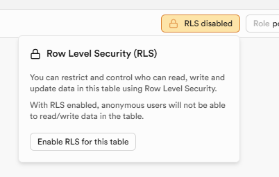

# 📘 Internal Knowledge Base App

A straightforward internal knowledge base app for organizing and sharing information. Built with React and Supabase, it supports user authentication, article management, search, and tagging, with room for growth and future integrations. The whole idea is to create a very accessible source of job aids for all departments of a company.

## Supabase Setup

### 1. Create Project
Create a new Supabase project.

### 2. Database Tables
In the SQL Editor, run the following scripts to create the required tables:

#### public.administrators
```sql
create table public.administrators (
  id bigint generated by default as identity not null,
  user_id uuid not null default auth.uid (),
  created_at timestamp with time zone null default now(),
  constraint administrators_pkey primary key (id),
  constraint administrators_user_id_key unique (user_id),
  constraint administrators_user_id_fkey foreign key (user_id) references auth.users (id) on update cascade on delete cascade
) tablespace pg_default;
```

#### public.articles
```sql
create table public.articles (
  id bigint generated by default as identity not null,
  user_id uuid not null default auth.uid (),
  created_at timestamp with time zone null default now(),
  constraint articles_pkey primary key (id),
  constraint articles_user_id_key unique (user_id),
  constraint articles_user_id_fkey foreign key (user_id) references auth.users (id) on update cascade on delete cascade
) tablespace pg_default;
```

### 3. Row Level Security (RLS)
In the Table Editor, enable RLS for both created tables:



#### Create RLS Policies
Policies must be created for the SDK to perform any successful database operations.

In the same area, click 'Add RLS policy' and create table policies for both tables.

For my project I enabled 'ALL' access with the target role of 'authenticated'.

Adjust roles based on your requirements.

### 4. User Management
In Authentication > Users, click 'Add user' to create the admin user:


In the SQL Editor or Table Editor, copy the UID of the newly created user, and insert a record in public.administrators table; the 'user_id' column should containt the copied UID.

### 5. Enable Data API
In Project Settings > Data API, enable 'Enable data API'

### 6. Edge Functions
In Edge Functions, 'Deploy a new function' and paste the following Express code to create the admin endpoints for user management. These endpoints will be called from the client via Axios.

```ts
// authAdmin.ts


// Setup type definitions for built-in Supabase Runtime APIs
import "jsr:@supabase/functions-js/edge-runtime.d.ts";
//@ts-ignore
import express from 'npm:express@5.0.1';
//@ts-ignore
import cors from 'npm:cors@2.8.5';
//@ts-ignore
import { createClient } from 'npm:@supabase/supabase-js@2';
const sb = createClient(Deno.env.get('SUPABASE_URL'), Deno.env.get('SUPABASE_SERVICE_ROLE_KEY'));
const app = express();
app.use(express.json());
app.use(cors());
// return all users
app.get('/user', async (req, res)=>{
  const { data: { users }, error } = await sb.auth.admin.listUsers({
    page: 1,
    perPage: 1000
  });
  if (error) {
    return res.status(400).json({
      message: error.message
    });
  }
  res.status(200).json(users);
});
// return a specific user
app.get('/user/:id', async (req, res)=>{
  const { data, error } = await sb.auth.admin.getUserById(req.params.id);
  if (error) {
    return res.status(400).json({
      message: error.message
    });
  }
  res.status(200).json(data);
});
// create a user
app.post('/user', async (req, res)=>{
  const { data, error } = await sb.auth.admin.createUser({
    email: req.body.email,
    password: req.body.password,
    email_confirm: true
  });
  if (error) {
    return res.status(400).json({
      user: data.user,
      error
    });
  }
  res.status(201).json({
    user: data.user,
    error
  });
});
// update a user
app.put('/user/:id', async (req, res)=>{
  const { data: user, error } = await sb.auth.admin.updateUserById(req.params.id, req.body);
  if (error) {
    return res.status(400).json({
      ...user,
      error
    });
  }
  res.status(200).json({
    ...user,
    error
  });
});
// delete a user
app.delete('/user', async (req, res)=>{
  const userId = req.body.id;
  const { error } = await sb.auth.admin.deleteUser(userId);
  if (error) {
    return res.status(400).json({
      message: error.message
    });
  }
  res.status(200).json({
    message: `User ${userId} deleted successfully`
  });
});
app.listen(8000, ()=>{
  console.log("Listening on port: 8000");
});

```
Copy the following Express code into an edge function:
