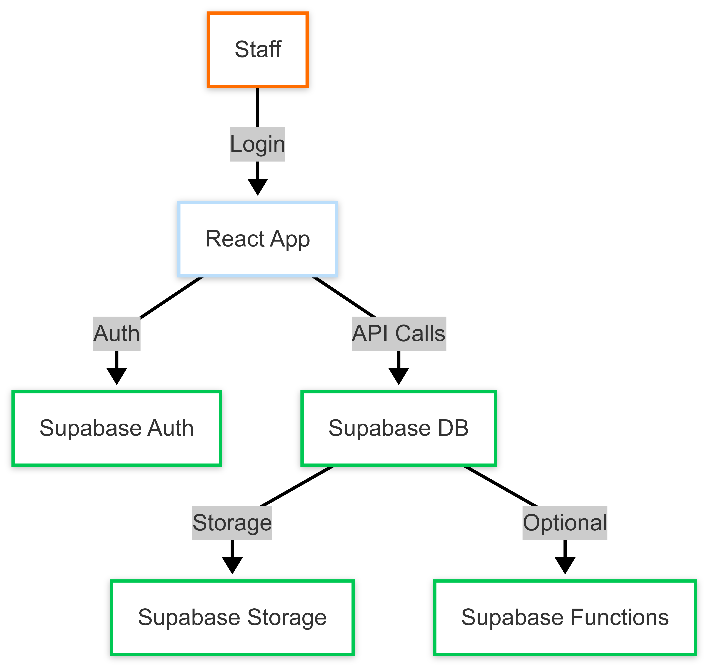

# 📘 Internal Knowledge Base App: Project Plan

---

## 📈 Project Plan

### Phase 1: Core MVP

**Goal:** Get a basic knowledge base running with essential features.

- ✅ User authentication: Supabase Auth (email/password login)
- ✅ Article CRUD: Admins can create, read, update, and delete articles
- ✅ Rich Text Editor: react-quill or TipTap
- ✅ Search: Supabase full-text search
- ✅ Basic layout: Homepage, article list, article detail, admin dashboard

### Phase 2: Polish & Expand

**Goal:** Improve usability, organization, and management.

- ✅ Categories/tags for organization
- ✅ Role-based permissions (viewer/admin)
- ✅ Responsive design

### Phase 3: Extras

**Goal:** Enhance user engagement and connect with other systems.

- ✅ Notifications: Email/in-app for new/updated articles
- ✅ Comments/feedback
- ✅ Integration with credit union systems
- ✅ Data visualization: usage stats

---

## 🛠️ Tech Stack & Architecture
**Frontend:** Vite + React, Shadcn UI
**Rich text editor:** react-quill or TipTap

**Backend:** Supabase
- Auth: Email/password login + RLS
- Database: PostgreSQL
  - articles (id, title, content, tags, created_at, updated_at)
  - users (id, email, role)
  - article_views
- Search: Postgres full-text search

**Deployment:**
- Frontend: Vercel
- Backend: Node Express on Vercel

---

## 🗂️ High-Level Architecture Diagram

